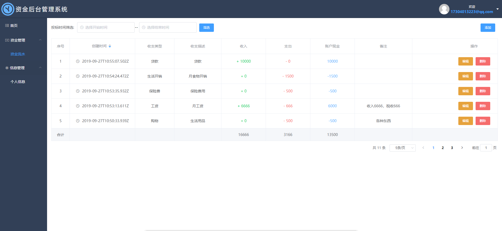
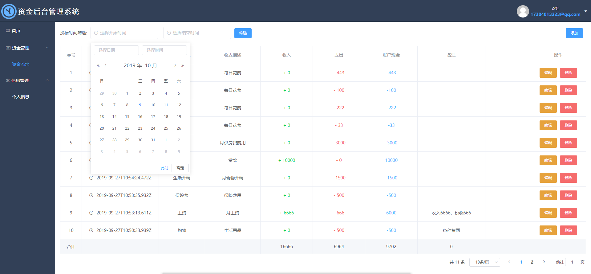

# nodeJS-vue-ele实现资金后台管理系统

> 使用NodeJs构建后端接口文档和VueCli3.x构建前端页面，UI使用ElementUI
> 学习搭建后端接口，以及熟悉实现全后端构建项目，认识前后端沟通交互方式。

## 相关技术
	
	1. NodeJS : 使用nodejs搭建后端接口文档，使用前端熟悉的javaScript代码编写。
	2. express : 方便快速搭建后端服务器的node框架。
	3. jsonwebtoken: 派发请求令牌，用于验证请求是否有效从而返回数据。
	4. vuecli3.x : 使用VueCli3.x搭建前端页面。
	5. ElementUI : 构建前端样式结构。
	6. Axios + MongoDB : axios请求获取数据，安装mongoose模块，进行后续的mongoDB的连接，规范数据类型与创建模型，并对数据库进行增删改查操作。
	
## 功能介绍

	+后端
	- 搭建路由和构建数据模型
	- 搭建注册接口和存储注册信息并加密密码
	- 搭建登录接口，获取请求的邮箱密码进行数据库匹配，成功即生成并返回token
	- 使用passport和passport-jwt插件验证token
	- 搭建信息获增删改接口。
	
	+前端
	- element搭建注册和登录表单
	- 路由守卫
	- token解析存储
	- vuex存储
	- 请求拦截和响应拦截
	- 加载动画和消息提醒
	- table表格展示资金数据
	- 数据的增删改操作
	- 数据分页和时间筛选
	- 404

## 项目编译和运行
  + git上下载源码或clone到本地，
	+ git@github.com:huaKai304/nodeJS-vue-ele-app.git
	
  + 根目录下依赖模块安装
	+ npm/cnpm install client-install 和 npm/cnpm install

  + 所有依赖安装成功后在当前目录启动执行启动命令,
	+ npm run serve
		
## 成果展示
 
 

